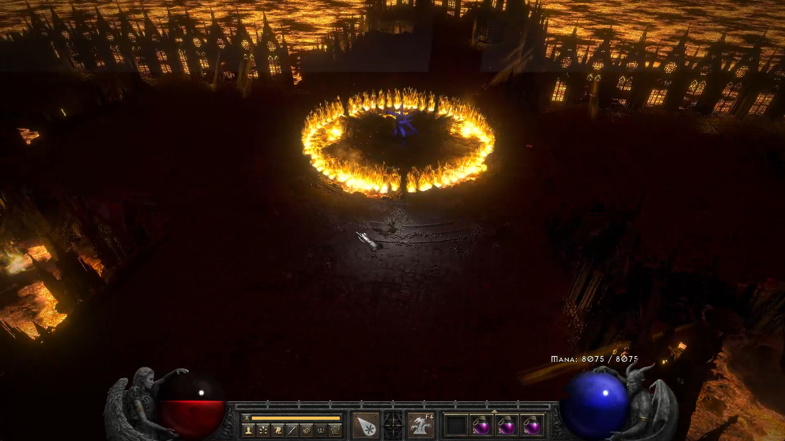
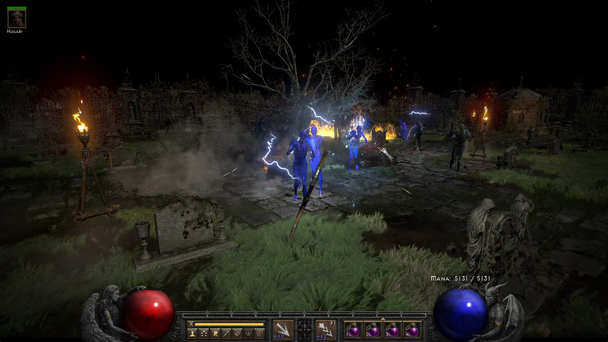
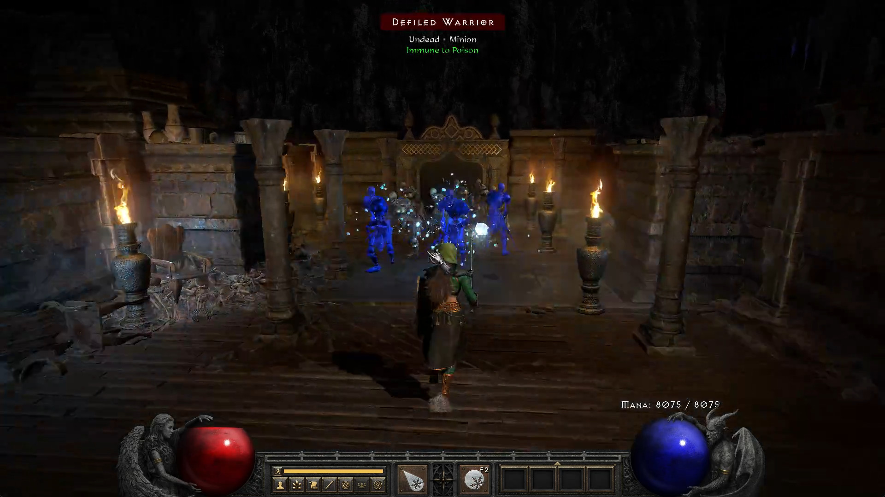

# Diablo II: Resurrected in 3D

Adds camera control to Diablo II: Resurrected.
Press F12 to activate, mouse wheel to zoom, middle mouse down to drag the camera.





## Standalone version

**This will trigger Diablo II's integrity check and the game will crash after a minute.**

### Binaries

Download from [GitHub releases](https://github.com/emmericp/D2R-3D/releases) or from [3d.diablo.deadlybossmods.com](https://3d.diablo.deadlybossmods.com/releases/d2r-3d-latest.zip)

Drop both the .exe and .dll file directly into your D2R folder (next to D2R.exe).
Press F12 to activate in the game.

### Build from source

Install [Bazel](https://bazel.build/install/windows).

```
bazel build //standalone:dist
```
Build output will be in `bazel-bin/standalone/dist/d2r-3d.{exe,dll}`.

## Plugin version

`bazel build //standalone:dist`. No further documentation, sorry.
